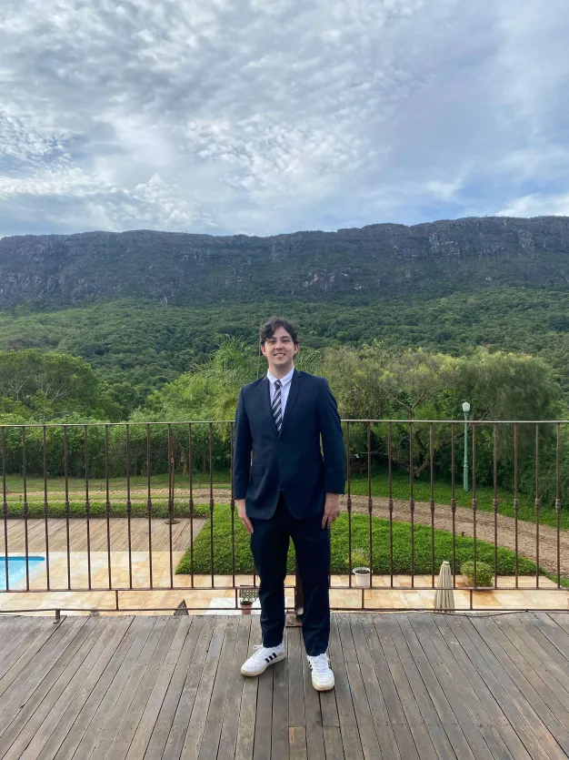
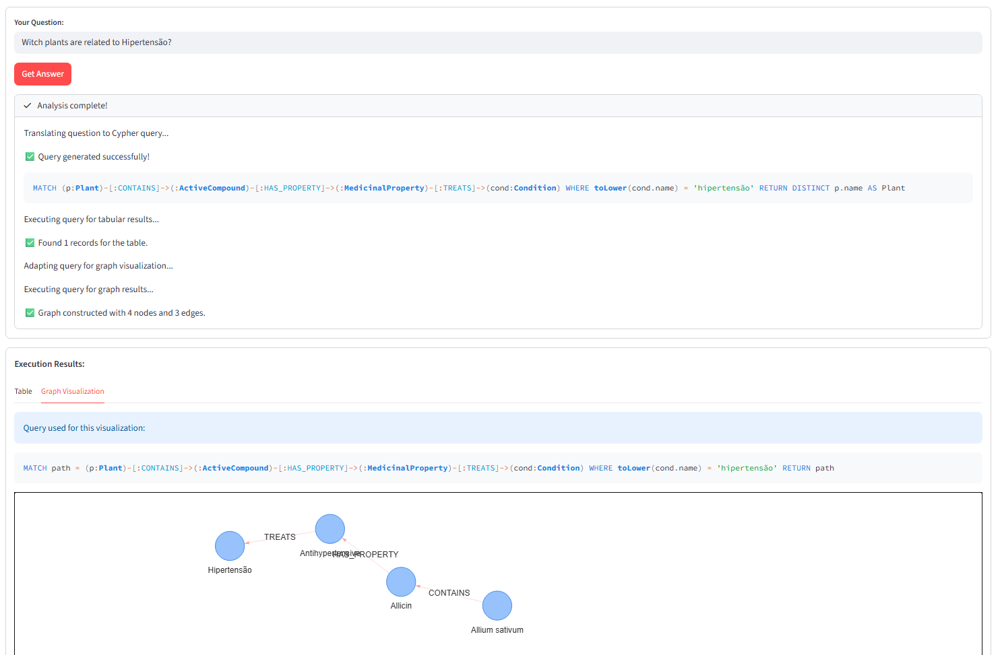

# 🏷️ Portfólio Profissional - Diogo Chaves Torres 👨‍💻

> Website moderno e responsivo desenvolvido para apresentar minha trajetória acadêmica na Engenharia de Software, projetos técnicos e experiências profissionais.

Este **README.md** segue o padrão acadêmico e profissional recomendado pelo **Prof. Dr. João Paulo Aramuni**, apresentando de forma clara a documentação, tecnologias e instruções de execução do projeto desenvolvido para a disciplina de **Laboratório de Desenvolvimento de Software**.

---

## 🚧 Status do Projeto

---

## 📚 Índice

- [Links Úteis](#-links-úteis)
- [Sobre o Projeto](#-sobre-o-projeto)
- [Funcionalidades Principais](#-funcionalidades-principais)
- [Tecnologias Utilizadas](#-tecnologias-utilizadas)
- [Arquitetura](#-arquitetura)
- [Instalação e Execução](#-instalação-e-execução)
- [Estrutura de Pastas](#-estrutura-de-pastas)
- [Demonstração](#-demonstração)
- [Autores](#-autores)
- [Agradecimentos](#-agradecimentos)
- [Licença](#-licença)

---

## 🔗 Links Úteis

🌐 **Demo Online:** [Acesse meu Portfólio aqui](https://diogotorres13.github.io/Portfo-lio-Profissional/)  
💻 **Repositório GitHub:** [Link do Projeto](https://github.com/diogotorres13/Portfo-lio-Profissional)

---

## 📝 Sobre o Projeto

O projeto consiste no desenvolvimento de um website de portfólio pessoal. A motivação principal é consolidar minha presença digital como estudante de Engenharia de Software, facilitando o acesso de recrutadores e parceiros às minhas competências técnicas.

**Onde pode ser utilizado:** Currículos online, perfis de LinkedIn e apresentações acadêmicas.  
**Problema resolvido:** Centralização de informações profissionais e acadêmicas em uma interface moderna e acessível via web.

---

## ✨ Funcionalidades Principais

- 🌎 **Internacionalização (i18n):** Seção "Sobre Mim" disponível em Português e Inglês.
- 📱 **Design Responsivo:** Adaptado para dispositivos móveis e desktops via Media Queries.
- ⏳ **Timeline de Projetos:** Exibição cronológica de algoritmos e ferramentas desenvolvidas.
- 💼 **Gestão de Experiências:** Histórico profissional detalhado com cargos e períodos.
- 📨 **Formulário de Contato:** Interface funcional para recebimento de mensagens e links para redes sociais (LinkedIn/WhatsApp).

---

## 🛠 Tecnologias Utilizadas

### 💻 Front-end
- **Linguagens:** HTML5 e JavaScript (Vanilla JS).
- **Estilização:** CSS3 puro com Flexbox.
- **Ícones:** [Font Awesome v6.5.0](https://cdnjs.cloudflare.com/ajax/libs/font-awesome/6.5.0/css/all.min.css).
- **Tipografia:** Arial, Helvetica, Sans-serif.

### ⚙️ Infraestrutura & DevOps
- **Versionamento:** Git e GitHub.
- **Deploy:** GitHub Pages.

---

## 🏗 Arquitetura

O sistema adota uma arquitetura de **Página Única (Single Page Application - SPA)** simplificada, focada em performance e semântica. 

- **Estrutura:** Organizada em seções (`<section>`) identificadas por IDs para navegação fluida (Smooth Scroll).
- **Padrões:** Utilização de Flexbox para o layout e responsividade.
- **Eventos:** Manipulação de DOM via JavaScript para interceptação de envios de formulário.

---

## 🔧 Instalação e Execução

### Pré-requisitos
- Um navegador web moderno (Google Chrome, Firefox, Safari ou Edge).
- (Opcional) Extensão **Live Server** no VS Code para desenvolvimento.

### Como Executar Localmente

1. **Clone o repositório**

      git clone https://github.com/diogotorres13/Portfo-lio-Profissional.git

2. **Abra a pasta**

3. **Abra o arquivo index.html no navegador**

---

### 📂 Estrutura de Pastas

Portfo-lio-Profissional/ 
│ 
├── index.html          # Arquivo principal (Estrutura) 
├── style.css           # Estilização e Responsividade (Visual) 
├── script.js           # Lógica de interação (Comportamento) 
├── README.md           # Documentação do projeto 
│ 
├── images/             # Recursos visuais 
│   ├── minha-foto.jpg  # Foto de perfil 
│   ├── projeto1.png    # Screenshot do projeto Assistente de Text-to-Cypher 
│   └── ...             # Demais imagens de projetos 
└── .gitignore          # Configuração de arquivos ignorados pelo Git 

## 🎥 Demonstração

### Aplicação Web

Para melhor visualização, as seções principais estão organizadas lado a lado.

| Perfil e Sobre Mim | Seção de Projetos | Contato |
| :---: | :---: | :---: |
|  |  | [Clique para ver na Web](https://diogotorres13.github.io/Portfo-lio-Profissional/) |

> **Nota:** O layout é totalmente responsivo, ajustando-se automaticamente para telas de celulares conforme as Media Queries do `style.css`.

---

## 👥 Autores

| Foto | Nome | GitHub | LinkedIn |
| :---: | :--- | :---: | :---: |
|  | **Diogo Chaves Torres** | [@diogotorres13](https://github.com/diogotorres13) | [LinkedIn](https://www.linkedin.com/in/diogo-torres-587487287) |

---

## 🙏 Agradecimentos

Gostaria de agradecer às seguintes instituições e pessoas que foram fundamentais para o desenvolvimento deste projeto:
- **Engenharia de Software PUC Minas** - Pelo suporte acadêmico, estrutura e incentivo às boas práticas de engenharia.
- **Prof. Dr. João Paulo Aramuni** - Pelos valiosos ensinamentos sobre Engenharia de Software e padrões de documentação profissional.

---

## 📄 Licença

Este projeto é distribuído sob a **Licença MIT**. Veja o arquivo `LICENSE` para mais detalhes.
